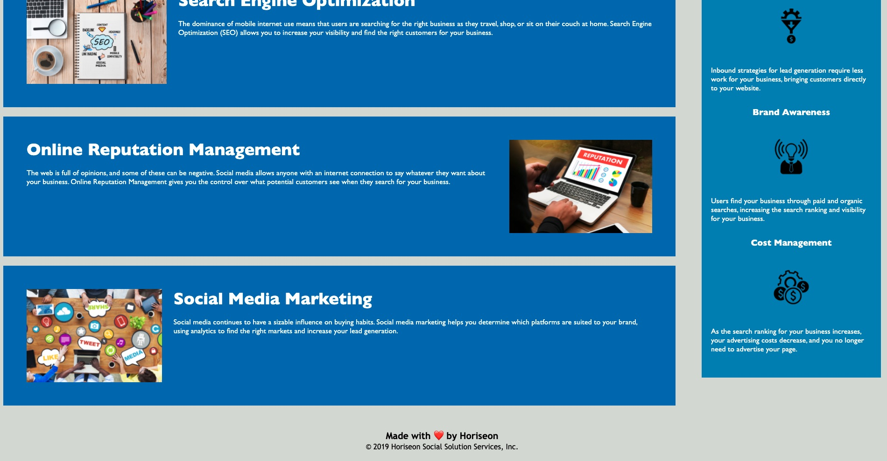

# Horiseon

## Description

The purpose of this assignment was to improve the overall functioning of the website and to meet adequate accessibility regulations so that the website was inclusive to all people. The improvements to the website will allow features to respond as they are intended to do. Items included on this task addressed proper link functioning, improved organization of semantic features, and enhanced accessibilty for all users. The lesson taught me how to spot errors in html, how to concise classes together, and how to improve the overall level organization of html and it's different sections. Another key learning point was the importance of creating websites that are accessible to any and all users. 

## Objectives

- ~~GIVEN a webpage meets accessibility standards~~

- ~~WHEN I view the source code~~
- ~~THEN I find semantic HTML elements~~

- ~~WHEN I view the structure of the HTML elements~~
- ~~THEN I find that the elements follow a logical structure independent of styling and positioning~~

- ~~WHEN I view the image elements~~
- ~~THEN I find accessible alt attributes~~

- ~~WHEN I view the heading attributes~~
- ~~THEN they fall in sequential order~~

- ~~WHEN I view the title element~~
- ~~THEN I find a concise, descriptive title~~

## Acceptance Criteria

Technical Acceptance Criteria: 40%
Satisfies all of the preceding acceptance criteria plus the following code improvements:

- ~~Application's links all function correctly.~~ 

- ~~Application's CSS selectors and properties are consolidated and organized to follow semantic structure.~~

- ~~Application's CSS file is properly commented.~~

Deployment: 32%
- ~~Application deployed at live URL.~~

- ~~Application loads with no errors.~~

- Application GitHub URL submitted.

- GitHub repository that contains application code.

Application Quality: 15%
- ~~Application resembles (at least 90%) screenshots provided in challenge instructions.~~

Repository Quality: 13%
- ~~Repository has a unique name.~~

- ~~Repository follows best practices for file structure and naming conventions.~~

- ~~Repository follows best practices for class/id naming conventions, indentation, quality comments, etc.~~

- Repository contains multiple descriptive commit messages.

- Repository contains quality README file with description, screenshot, and link to deployed application.

### Before Updates

### After Updates

## License

MIT License

Copyright (c) [2022] [adrianapvent]

Permission is hereby granted, free of charge, to any person obtaining a copy
of this software and associated documentation files (the "Software"), to deal
in the Software without restriction, including without limitation the rights
to use, copy, modify, merge, publish, distribute, sublicense, and/or sell
copies of the Software, and to permit persons to whom the Software is
furnished to do so, subject to the following conditions:

The above copyright notice and this permission notice shall be included in all
copies or substantial portions of the Software.

THE SOFTWARE IS PROVIDED "AS IS", WITHOUT WARRANTY OF ANY KIND, EXPRESS OR
IMPLIED, INCLUDING BUT NOT LIMITED TO THE WARRANTIES OF MERCHANTABILITY,
FITNESS FOR A PARTICULAR PURPOSE AND NONINFRINGEMENT. IN NO EVENT SHALL THE
AUTHORS OR COPYRIGHT HOLDERS BE LIABLE FOR ANY CLAIM, DAMAGES OR OTHER
LIABILITY, WHETHER IN AN ACTION OF CONTRACT, TORT OR OTHERWISE, ARISING FROM,
OUT OF OR IN CONNECTION WITH THE SOFTWARE OR THE USE OR OTHER DEALINGS IN THE
SOFTWARE.